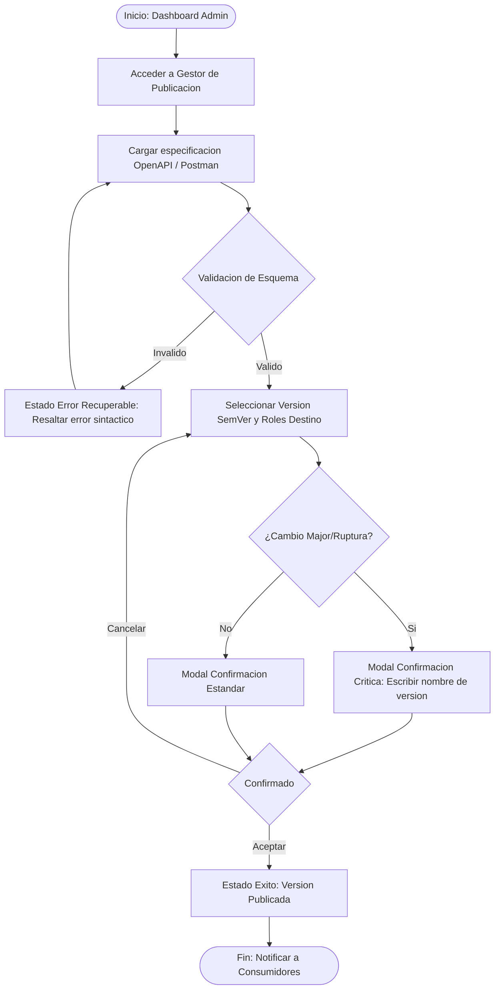
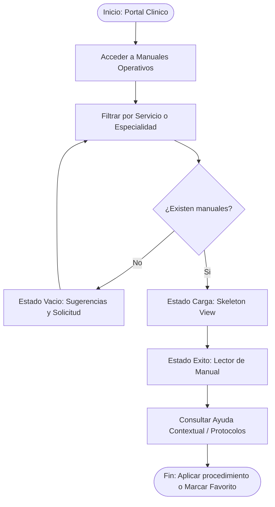
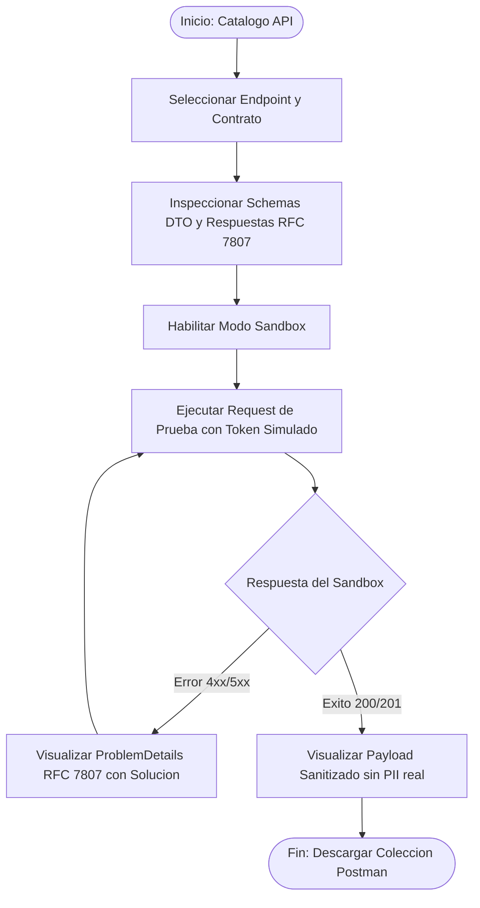

# Flujos de Usuario por Rol (User Flows) - ASII-24

Este documento detalla los flujos de interacción de inicio a fin para los roles autorizados en el **Centro de Documentación y Manuales por Rol**.

---

## Flujo 1: Publicación y Versionado de Contratos API (Rol: Administrador / API Publisher)

### Pasos Detallados:
1. **Inicio:** El Administrador ingresa al Centro de Documentación y selecciona «Publicar Nueva Versión».
2. **Carga y Validación:** Sube archivo YAML/JSON o edita en línea. El sistema evalúa la especificación OpenAPI 3.0 contra el linter interno.
3. **Decisión y Selección:** Elige el incremento de versión (Major, Minor, Patch) y define la visibilidad por rol (`Público`, `Clínico`, `Técnico`).
4. **Confirmación:** Si el cambio introduce deprecaciones o *breaking changes*, se activa un modal restrictivo.
5. **Éxito y Distribución:** Se actualiza el repositorio central de contratos y se regeneran las colecciones Postman v2.1.

---

## Flujo 2: Consulta de Manuales Operativos y Guías Clínicas (Rol: Médico / Enfermería)

### Pasos Detallados:
1. **Inicio:** El personal asistencial accede desde la barra superior del sistema hospitalario.
2. **Búsqueda y Filtro:** Ingresa términos como "Protocolo Triage", "Solicitud Hemograma" o selecciona por servicio clínico.
3. **Gestión de Estados:**
   - Si no hay coincidencias: se despliega estado vacío con guías recomendadas.
   - Durante la petición: esqueleto visual animado sin parpadeos.
4. **Lectura y Ayuda Contextual:** Visualiza el procedimiento paso a paso con badges de advertencia de seguridad del paciente.

---

## Flujo 3: Inspección de Endpoints y Sandbox Interactivo (Rol: Auditor / Desarrollador Integrador)

### Pasos Detallados:
1. **Inicio:** El integrador explora los módulos disponibles en el catálogo OpenAPI.
2. **Inspección de Contrato:** Revisa la definición de esquemas de entrada/salida (DTOs) y cabeceras obligatorias.
3. **Prueba en Sandbox:** Realiza peticiones HTTP simuladas con inyección de datos sintéticos.
4. **Protección y Retroalimentación:** La consola oculta automáticamente cualquier dato personal identificable (PII) y muestra diagnósticos claros según RFC 7807.
