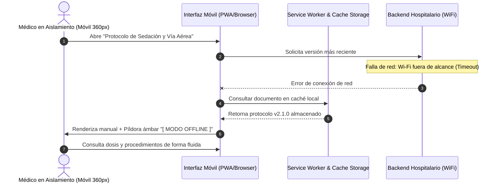
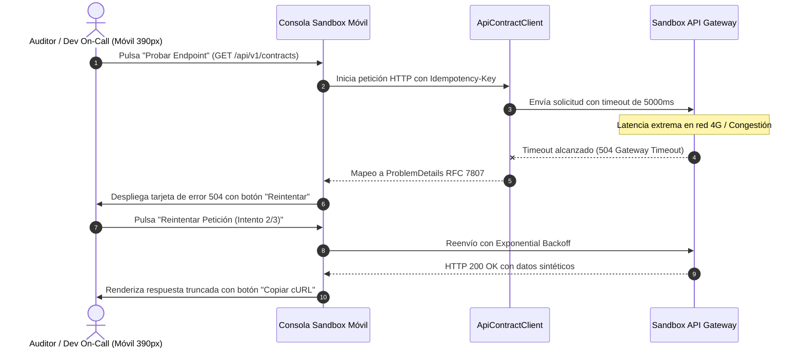

# Escenarios Móviles Extremos y Decisiones de Contenido - ASII-24

Este documento formaliza dos escenarios de uso en movilidad con condiciones operativas hospitalarias y manejo de fallos.

---

## Escenario 1: Médico de Guardia Consultando Protocolo con Pérdida de Conexión Wi-Fi

### Decisiones de Contenido y Jerarquía:
1. **Priorización Clínica:** Se colocan en la parte superior las dosis de fármacos y alertas de riesgo vital.
2. **Colapso de Información Secundaria:** Las referencias bibliográficas, historial de versiones y firmas de comité se ocultan dentro de un acordeón cerrado para no saturar la pantalla de 360 px.
3. **Manejo de Errores y Notificación:** No se interrumpe al médico con un pop-up bloqueante. En su lugar, un indicador superior discreto en color ámbar informa: *"Modo sin conexión: visualizando copia local vigente"*.

---

## Escenario 2: Desarrollador On-Call Ejecutando Sandbox con Timeout y Fallo de Red Celular

### Decisiones de Contenido y Jerarquía:
1. **Prevención de Pérdida de Datos:** Los parámetros ingresados por el desarrollador en el formulario móvil no se borran al ocurrir el timeout.
2. **Diagnóstico Accesible RFC 7807:** El error se visualiza con título amigable: *"Tiempo de espera agotado (504). La red tardó más de 5 segundos en responder"*.
3. **Mecanismo de Recuperación:** Se provee un botón táctil de ancho completo `[ Reintentar Petición ]` que ejecuta un reintento con *Exponential Backoff* (2s, 4s, 8s) sin recargar la página.
