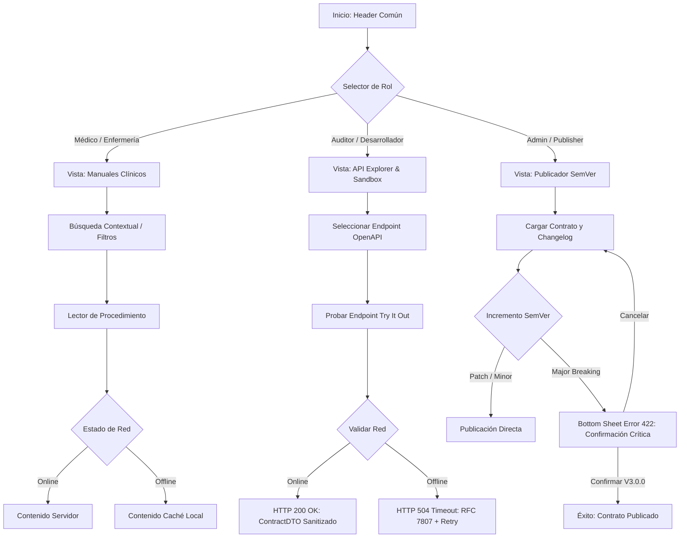

# Mapa de Navegación y Transición de Estados - ASII-24

Este documento define la arquitectura de navegación, árbol de rutas y flujo de estados del prototipo interactivo (`prototype/index.html`).

---

## 1. Árbol de Rutas y Transiciones

El prototipo implementa una máquina de estados determinista gobernada por roles y contexto de conectividad:

---

## 2. Matriz de Estados de la Interfaz

| Estado UI | Evento Detonador | Componente Visual | Retroalimentación Accesible |
| :--- | :--- | :--- | :--- |
| **`INITIAL`** | Carga inicial de la aplicación | Hub renderizado según rol activo | Título de página anunciado al lector de pantalla |
| **`LOADING`** | Pulsación de "Try It Out" | Caja de estado con indicador animado | Región `aria-live="polite"` anuncia "Ejecutando..." |
| **`SUCCESS`** | Simulación de endpoint exitosa | Contenedor verde con JSON formateado | Badge HTTP 200 OK y botón de copia rápida |
| **`CRITICAL_ERROR`** | Intento de publicar Major sin texto | Bottom Sheet emergente con RFC 7807 | Atributo `aria-invalid="true"`, foco en input y `role="alert"` |
| **`OFFLINE`** | Caída de conexión simulada | Píldora ámbar `[ ▲ MODO OFFLINE ]` | Transición a copia local en Service Worker cache |
